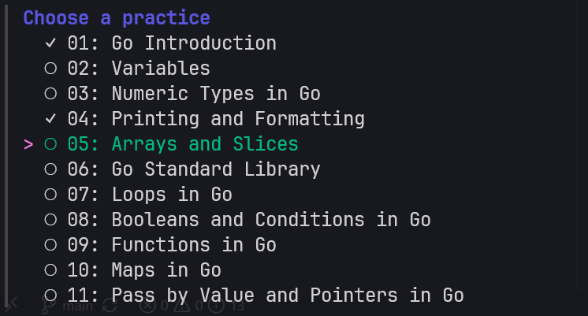

# Go Fundamentals

A growing collection of small Go practices with matching Markdown notes and Go examples.



## Run the Practice CLI Tool

Run the CLI from the repository root and choose a practice with the arrow keys:

```powershell
go run .
```

Alternatively, provide the number directly:

```powershell
go run . 3
```

Completed practices are saved in your operating system's user configuration
directory. The menu and `--list` command show your progress.

```powershell
# Show every practice and its completion status.
go run . --list

# Run the first practice you have not completed.
go run . --resume

# Clear all saved progress.
go run . --reset-progress

# Show command help.
go run . --help
```

Press `Esc` or `Ctrl+C` to leave the interactive menu without an error.
After a practice finishes, the interactive session stays open so you can run
the next practice, repeat it, choose another one, or quit. Providing a practice
number directly remains a one-shot command.

## Available Practices

| Number | Topic | Go example | Notes |
| ---: | --- | --- | --- |
| 1 | Go introduction | [01_go_intro.go](practice/01_go_intro.go) | [01_go_intro.md](markdown/01_go_intro.md) |
| 2 | Variables | [02_vars.go](practice/02_vars.go) | [02_vars.md](markdown/02_vars.md) |
| 3 | Numeric types | [03_numbers_in_go.go](practice/03_numbers_in_go.go) | [03_numbers_in_go.md](markdown/03_numbers_in_go.md) |
| 4 | Printing and formatting | [04_formatting.go](practice/04_formatting.go) | [04_formatting.md](markdown/04_formatting.md) |
| 5 | Arrays and slices | [05_arrays_and_slices.go](practice/05_arrays_and_slices.go) | [05_arrays_and_slices.md](markdown/05_arrays_and_slices.md) |
| 6 | Go Standard Library | [06_go_standard_library.go](practice/06_go_standard_library.go) | [06_go_standard_library.md](markdown/06_go_standard_library.md) |
| 7 | Loops in Go | [07_loops.go](practice/07_loops.go) | [07_loops.md](markdown/07_loops.md) |
| 8 | Booleans and Conditions in Go | [08_booleans_and_conditions.go](practice/08_booleans_and_conditions.go) | [08_booleans_and_conditions.md](markdown/08_booleans_and_conditions.md) |
| 9 | Functions in Go | [09_functions.go](practice/09_functions.go) | [09_functions.md](markdown/09_functions.md) |
| 10 | Maps in Go | [10_maps.go](practice/10_maps.go) | [10_maps.md](markdown/10_maps.md) |
| 11 | Pass by Value and Pointers in Go | [11_pointers.go](practice/11_pointers.go) | [11_pointers.md](markdown/11_pointers.md) |
| 12 | Structs and Custom Types in Go | [12_structs_and_custom_types.go](practice/12_structs_and_custom_types.go) | [12_structs_and_custom_types.md](markdown/12_structs_and_custom_types.md) |
| 13 | Type Conversions in Go | [13_type_conversions.go](practice/13_type_conversions.go) | [13_type_conversions.md](markdown/13_type_conversions.md) |
| 14 | Saving Files in Go | [14_saving_files.go](practice/14_saving_files.go) | [14_saving_files.md](markdown/14_saving_files.md) |
| 15 | Interfaces in Go | [15_interfaces.go](practice/15_interfaces.go) | [15_interfaces.md](markdown/15_interfaces.md) |

Go examples are stored in [`practice/`](practice), and their explanations are stored in [`markdown/`](markdown). More practices will be added over time.
