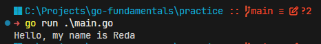

# Go

[Corresponding Go file](../practice/01_go_intro.go)

Go is a statically typed, compiled programming language designed at Google. It is known for its simplicity, efficiency, and strong support for concurrent programming. Go is often used for building web servers, networking tools, and other performance-critical applications.

## Is Go Objective Oriented?

Go is not a traditional object-oriented programming language, but it does support some object-oriented concepts. In Go, you can define types (structs) and associate methods with them, which allows for encapsulation and behavior similar to classes in other languages. However, Go does not have inheritance or polymorphism in the same way that languages like C# or C++ do.

Go has:
    - Structs: like simple data structures that can hold fields and methods.
    - Methods: functions that are associated with a specific type (struct).
    - Interfaces: which allow you to define a set of method signatures that a type must implement, enabling polymorphism.
  
Example of a struct and method in Go:

```go
type Person struct {
    Name string
    Age  int
}

func (p Person) Hi() string {
    return "Hello, my name is " + p.Name
}
```

Calling the method:

```go
func main() {
    p := Person{Name: "Reda", Age: 21}
    fmt.Println(p.Hi())
}
```

Output:



## Summary

Go is a compiled, statically typed language that favors simple building blocks and composition over class-based inheritance.

- Structs group related data into one type.
- Methods attach behavior to a type.
- Interfaces describe behavior without requiring inheritance.
