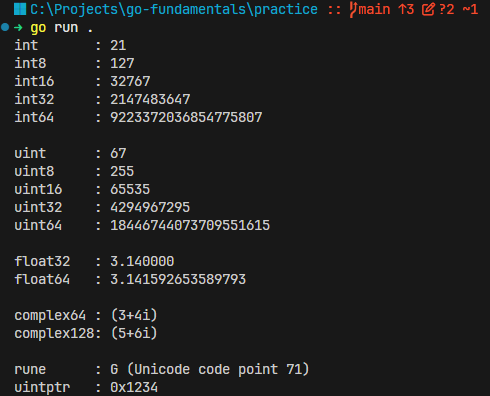

## Numbers


Numbers in Go can be of different types, including integers and floating-point numbers. Here are some examples:

```go
	// Integer types
	var age int = 25
	var year int32 = 2021

	// Floating-point types
	var height float32 = 5.9
	var weight float64 = 70.5

	fmt.Println("Age:", age)
	fmt.Println("Year:", year)
	fmt.Println("Height:", height)
	fmt.Println("Weight:", weight)
```

[Corresponding Go file](../practice/03_numbers_in_go.go)

Output: 



## List of Numeric Types in Go

list of integer types in Go:
- int   (platform-dependent size, either 32 or 64 bits)
- int8  (8-bit  signed integer, range: -128 to 127)
- int16 (16-bit signed integer, range: -32,768 to 32,767)
- int32 (32-bit signed integer, range: -2,147,483,648 to 2,147,483,647)
- int64 (64-bit signed integer, range: -9,223,372,036,854,775,808 to 9,223,372,036,854,775,807)

list of unsigned integer types in Go:
- uint   (platform-dependent size, either 32 or 64 bits)
- uint8  (8-bit  unsigned integer, range: 0 to 255)
- uint16 (16-bit unsigned integer, range: 0 to 65,535)
- uint32 (32-bit unsigned integer, range: 0 to 4,294,967,295)
- uint64 (64-bit unsigned integer, range: 0 to 18,446,744,073,709,551,615)

list of floating-point types in Go:
- float32 (32-bit floating-point number, range: approximately ±1.18e-38 to ±3.4e38, with 6-7 decimal digits of precision)
- float64 (64-bit floating-point number, range: approximately ±2.23e-308 to ±1.8e308, with 15-16 decimal digits of precision)

list of complex number types in Go:
- complex64  (a complex number with float32 real and imaginary parts)
- complex128 (a complex number with float64 real and imaginary parts)

list of other numeric types in Go:
- rune  (alias for int32, represents a Unicode code point)
- uintptr (an unsigned integer type that is large enough to hold the bit pattern of any pointer, this type is used for low-level programming and is not commonly used in everyday Go programming)

## Summary

Go provides distinct numeric types so programs can choose the range, precision, and representation appropriate for each value.

- Use `int` for ordinary whole-number calculations.
- Use unsigned integers only when their non-negative range is meaningful.
- Prefer `float64` for general decimal calculations.
- Remember that `rune` represents a Unicode code point.
