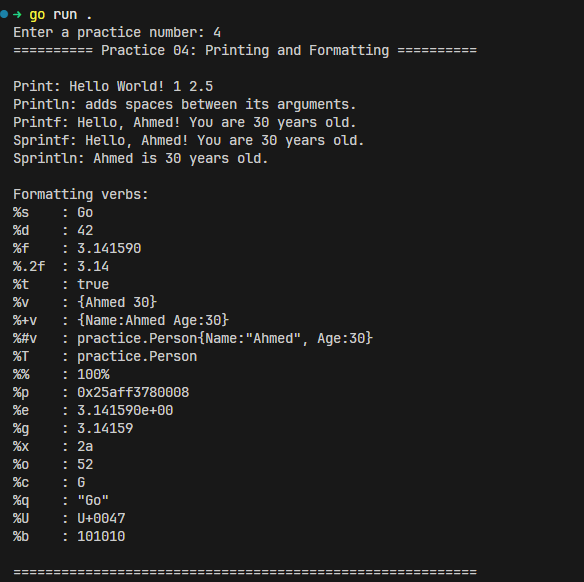

# Printing and Formatting in Go


In go, the `fmt` package provides functions for formatted I/O. The most commonly used functions are `Print`, `Println`, and `Printf`.

## Print and Println

- `Print` prints the arguments without newline.
- `Println` prints the arguments with a newline at the end.

You add arguments to these functions, and they will be printed in the order they are provided.

```go
Print("Hello", " World! ", 1, 2.5) // Output: Hello World! 1 2.5
```
[Corresponding Go file](../practice/04_formatting.go)



## Printf (Formatted Print)

The `Printf` function allows you to format the output using a format string and arguments. It provides more control over how the values are displayed.

```go
name := "Ahmed"
age := 30
Printf("Hello, %s! You are %d years old.", name, age) // Output: Hello, Ahmed! You are 30 years old.
```

%s and %d are format verbs/specifiers that tell `Printf` how to format the corresponding argument. There are many format verbs available for different data types.

## Sprintf and Sprintln (Saved Formatted Strings)

- `Sprintf` formats the string and returns it without printing.
- `Sprintln` formats the string and returns it with a newline at the end.

```go
name := "Khalid"
age := 20
greeting := Sprintf("Hello, %s! You are %d years old.", name, age)
fmt.Println(greeting) // Output: Hello, Khalid! You are 20 years old.
```


## Formatting Verbs

Formatting verbs for `Printf`, `Sprintf`, and `Sprintln` include:

- `%s` - String
- `%d` - Integer
- `%f` - Floating-point number
- `%.2f` - Floating-point number with 2 decimal places and rounded
- `%t` - Boolean
- `%v` - Default format for the value
- `%+v` - Adds field names for structs
- `%#v` - Go-syntax representation of the value
- `%T` - Type of the value
- `%%` - Literal percent sign
- `%p` - Pointer address
- `%e` - Scientific notation for floating-point numbers
- `%g` - Compact representation of floating-point numbers
- `%x` - Hexadecimal representation of integers
- `%o` - Octal representation of integers
- `%c` - Character representation of an integer (Unicode code point)
- `%q` - Quoted string or character literal
- `%U` - Unicode format: U+1234; same as "U+%04X"
- `%b` - Binary representation of integers
  
fmt docs: <https://pkg.go.dev/fmt>
