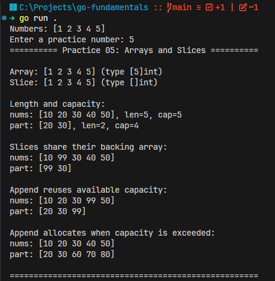

# Arrays and Slices in Go



Array is a fixed-size collection of elements of the same type. A slice is a flexible-size view into an array.

```go
arr := [3]int{10, 20, 30} // array, fixed size
s := []int{10, 20, 30}    // slice, flexible size
```

Rule:

```text
[3]int   => array with size 3
[]int    => slice
[...]int => array, Go counts the size
```

Example:

```go
a := [...]int{1, 2, 3, 4, 5}
s := []int{1, 2, 3, 4, 5}

fmt.Printf("%T\n", a) // [5]int
fmt.Printf("%T\n", s) // []int
```

Arrays have fixed size, and the size is part of the type:

```go
var a [3]int
var b [4]int

// [3]int and [4]int are different types
```

Slices are more common in Go projects:

```go
nums := []int{10, 20, 30, 40, 50} // slice
```

## `len` vs `cap`

```go
nums := []int{10, 20, 30, 40, 50}

fmt.Println(len(nums)) // 5
fmt.Println(cap(nums)) // 5
```

```text
len = visible elements
cap = how far the slice can grow forward before new memory is needed
```

Example:

```go
nums := []int{10, 20, 30, 40, 50}
part := nums[1:3]

fmt.Println(part)      // [20 30]
fmt.Println(len(part)) // 2
fmt.Println(cap(part)) // 4
```

Why capacity is `4`:

```text
nums:  [10, 20, 30, 40, 50]
index:   0   1   2   3   4
part:       [20, 30]
cap:        [20, 30, 40, 50]
```

```text
len = end - start
cap = source slice capacity - start
```

So:

```go
part := nums[1:3]

fmt.Println(len(part)) // 2
fmt.Println(cap(part)) // 4
```

The slice starts at index `1`, so it can grow forward through:

```text
[20, 30, 40, 50]
```

It cannot grow backward to include the preceding element `10`.

```text
array: len == cap always
slice: len and cap can be different
```

## Slices share memory

A slice is a **view into an array**.

```go
nums := []int{10, 20, 30, 40, 50}
part := nums[1:3]

part[0] = 99

fmt.Println(nums) // [10 99 30 40 50]
fmt.Println(part) // [99 30]
```

`part[0]` and `nums[1]` use the same memory.

## `append`

You can append to a slice, but not directly to an array.

```go
nums := []int{10, 20, 30, 40, 50}
nums = append(nums, 60)

fmt.Println(nums) // [10 20 30 40 50 60]
```

This does not work:

```go
arr := [3]int{10, 20, 30}

arr = append(arr, 40) // cannot append to array
```

## `append` may reuse the same backing array

```go
nums := []int{10, 20, 30, 40, 50}
part := nums[1:3]

part = append(part, 99)

fmt.Println(part) // [20 30 99]
fmt.Println(nums) // [10 20 30 99 50]
```

Because `part` still had capacity, `append` reused the same backing array.

## `append` may allocate new memory

```go
nums := []int{10, 20, 30, 40, 50}
part := nums[1:3]

part = append(part, 60, 70, 80)

fmt.Println(part) // [20 30 60 70 80]
fmt.Println(nums) // [10 20 30 40 50]
```

If the slice outgrows its capacity, Go creates a new backing array.

Rule:

```text
slice = view into an array
same backing array until append needs more capacity
```

## Summary

Arrays have a fixed length, while slices are flexible views over arrays whose length and capacity can change as the program works with them.

- An array's length is part of its type.
- A slice may share its backing array with other slices.
- `len` counts accessible elements; `cap` measures available backing storage.
- Always assign the value returned by `append`.
