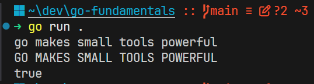

# The Go Standard Library

The Go standard library is a collection of packages that comes with Go. These packages solve common problems such as formatting text, working with strings, sorting values, reading files, handling dates, and communicating over the network.

You do not need to download standard-library packages. Import them by their package path:

```go
import (
	"fmt"
	"sort"
	"strings"
)
```

In this lesson:

- `fmt` prints the results.
- `strings` works with UTF-8 encoded strings.
- `sort` orders slices in place.

## Working with the `strings` package

The `strings` package provides functions for searching, cleaning, splitting, joining, and changing strings.

```go
message := "  go makes small tools powerful  "
clean := strings.TrimSpace(message)

fmt.Println(clean)
fmt.Println(strings.ToUpper(clean))
fmt.Println(strings.Contains(clean, "tools"))
```

Output:

```text
go makes small tools powerful
GO MAKES SMALL TOOLS POWERFUL
true
```



`TrimSpace` returns a new string without leading or trailing whitespace. Strings are immutable in Go, so the original `message` is not changed.

String searches are case-sensitive:

```go
fmt.Println(strings.Contains("Go is fun", "Go")) // true
fmt.Println(strings.Contains("Go is fun", "go")) // false
```

## Splitting and joining strings

`strings.Fields` splits text around one or more whitespace characters:

- returns: a slice of strings

```go
words := strings.Fields("go makes small tools powerful")
fmt.Println(words) // [go makes small tools powerful]
```

`strings.Join` combines a slice of strings using a separator:

- returns: a single string

```go
joined := strings.Join(words, " | ")
fmt.Println(joined) // go | makes | small | tools | powerful
```

Use `Fields` for words separated by whitespace. Use `Split` when you need a specific separator:

```go
colors := strings.Split("red,green,blue", ",")
fmt.Println(colors) // [red green blue]
```

## Working with the `sort` package

The `sort` package can order slices of common built-in types.

```go
scores := []int{42, 7, 19, 7}
sort.Ints(scores)

fmt.Println(scores) // [7 7 19 42]
```

Unlike the functions in the earlier `strings` examples, `sort.Ints` changes the original slice. It does not return a new sorted slice.

Use `sort.Strings` for a slice of strings:

```go
names := []string{"Zoe", "Ahmed", "Mina"}
sort.Strings(names)

fmt.Println(names) // [Ahmed Mina Zoe]
```

The sort is ascending. For strings, ordering is lexicographical and compares Unicode code points, so uppercase and lowercase letters can affect the result.

If the original order must be kept, copy the slice before sorting:

```go
scores := []int{42, 7, 19, 7}
sortedScores := append([]int(nil), scores...)
sort.Ints(sortedScores)

fmt.Println(scores)       // [42 7 19 7]
fmt.Println(sortedScores) // [7 7 19 42]
```

## Combining standard-library packages

Packages are small building blocks that can be combined:

```go
input := "pear,apple,banana"
fruit := strings.Split(input, ",")
sort.Strings(fruit)
result := strings.Join(fruit, ", ")

fmt.Println(result) // apple, banana, pear
```

Here, `strings.Split` creates a slice, `sort.Strings` orders it, and `strings.Join` turns it back into one string.

## Summary

The standard library provides focused packages that can be combined to solve common tasks without adding external dependencies.

- Import only the packages the file uses.
- Use `strings` to clean, split, inspect, and join text.
- Remember that sorting functions such as `sort.Ints` modify the slice.
- Combine small package functions to build a complete transformation.
