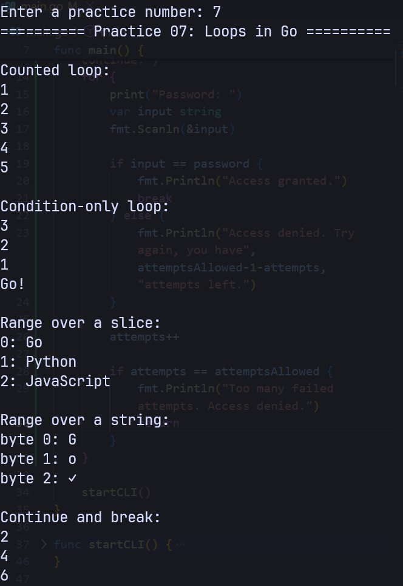

# Loops in Go

A loop repeats a block of code. Go uses the `for` keyword for every kind of loop.

You can use `for` to:

- repeat code a known number of times;
- repeat code while a condition is true;
- visit each value in a collection;
- keep running until `break` stops the loop.


## A counted `for` loop

A traditional `for` loop has three parts:

```go
for initialization; condition; update {
	// code to repeat
}
```

Example:

```go
for number := 1; number <= 5; number++ {
	fmt.Println(number)
}
```

Output:

```text
1
2
3
4
5
```

The loop works in this order:

1. `number := 1` runs once before the loop starts.
2. `number <= 5` is checked before each iteration.
3. The loop body runs when the condition is `true`.
4. `number++` runs after each iteration.

The variable declared in the loop is scoped to that loop:

```go
for number := 1; number <= 5; number++ {
	fmt.Println(number)
}

// number is not available here
```

## A condition-only loop

Go does not have a `while` keyword. Use `for` with only a condition instead:

```go
countdown := 3

for countdown > 0 {
	fmt.Println(countdown)
	countdown--
}

fmt.Println("Go!")
```

Output:

```text
3
2
1
Go!
```

Remember to update a value used by the condition. Otherwise, the condition may remain true forever.

## Looping with `range`

Use `range` to visit the elements in an array, slice, string, or map.

When ranging over a slice, Go provides the index and a copy of the value:

```go
languages := []string{"Go", "C#", "C++", "TypeScript", "SQL"}

for index, language := range languages {
	fmt.Printf("%d: %s\n", index, language)
}
```

Output:

```text
0: Go
1: C#
2: C++
3: TypeScript
4: SQL
```

If you do not need the index, use the blank identifier `_`:

```go
for _, language := range languages {
	fmt.Println(language)
}
```

If you only need the index, omit the second variable:

```go
for index := range languages {
	fmt.Println(index)
}
```

## Ranging over strings

Ranging over a string produces a byte index and a Unicode code point called a rune:

```go
for index, character := range "Go✓ Lang" {
	fmt.Printf("byte %d: %c\n", index, character)
}
```

Output:

```text
byte 0: G
byte 1: o
byte 2: ✓
byte 5:
byte 6: L
byte 7: a
byte 8: n
byte 9: g
```

The indexes are byte positions, not character counts. The check mark uses more than one byte in UTF-8, even though the loop visits it once.

## Skipping with `continue`

`continue` skips the rest of the current iteration and moves to the next one.

This loop prints only even numbers:

```go
for number := 1; number <= 6; number++ {
	if number%2 != 0 {
		continue
	}

	fmt.Println(number)
}
```

Output:

```text
2
4
6
```

The `%` operator returns the remainder. An even number has a remainder of `0` when divided by `2`.

## Stopping with `break`

`break` exits the nearest loop immediately:

```go
for number := 1; number <= 10; number++ {
	if number > 3 {
		break
	}

	fmt.Println(number)
}
```

Output:

```text
1
2
3
```

## An infinite loop

A `for` statement without a condition keeps running:

```go
for {
	fmt.Println("running")
}
```

Infinite loops are useful for servers and programs that wait for input, but they normally need a way to stop:

```go
attempts := 0

for {
	attempts++

	if attempts == 3 {
		break
	}
}
```

## Common loop mistakes

- Using `<` when `<=` is needed, or the reverse.
- Forgetting to update a condition variable.
- Accessing an index outside the valid range of a slice.
- Expecting `break` to stop more than the nearest loop.
- Forgetting that `range` returns copies of slice values.

For index-based slice loops, keep the index below the slice length:

```go
values := []int{10, 20, 30}

for index := 0; index < len(values); index++ {
	fmt.Println(values[index])
}
```
